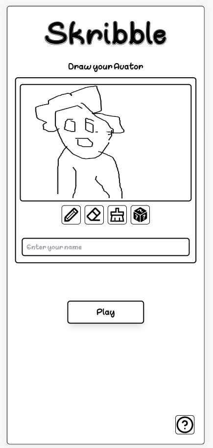
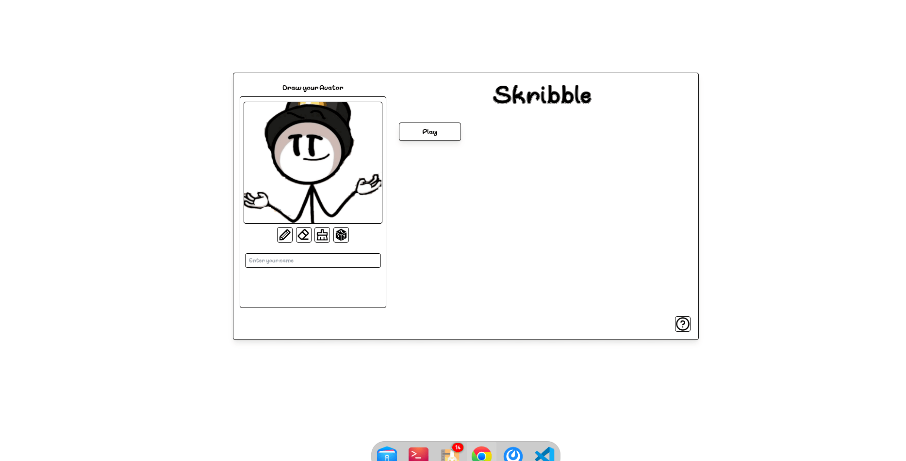
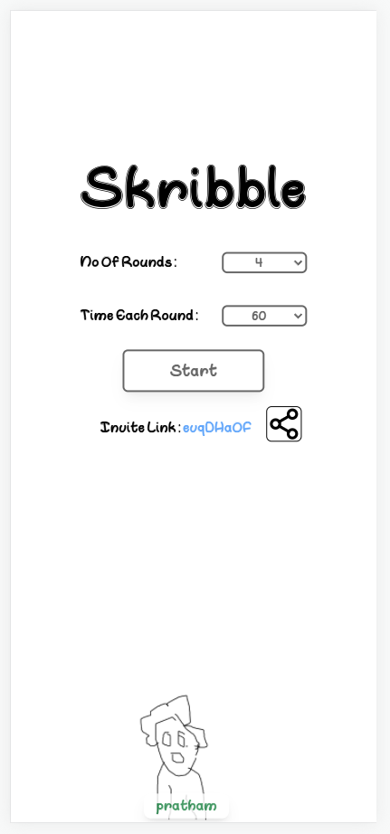
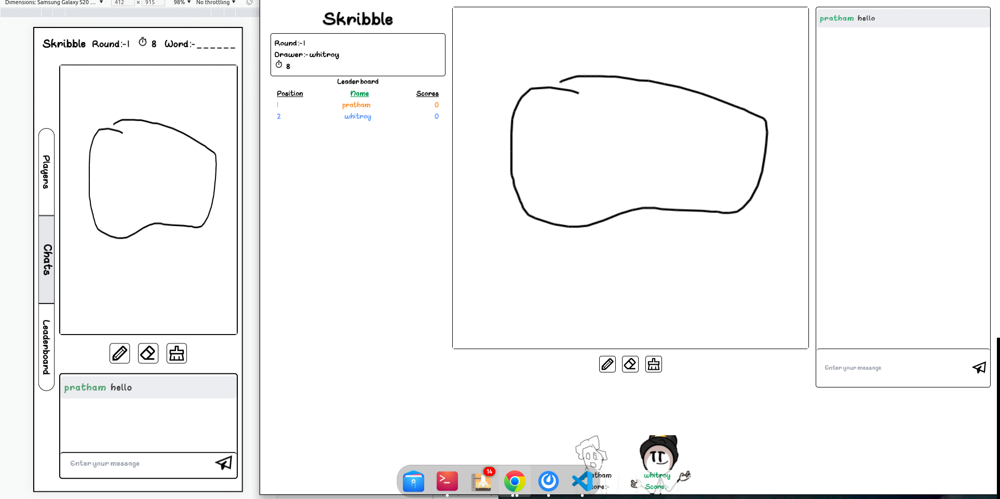

# Skribble - multiplayer canavs game

## Table of Contents
* [Introduction](#introduction)
* [Project Aim](#project-aim)
* [Tech Stack](#tech-stack)
* [Setup](#setup)
* [Features](#features)
* [LLD Design](#lld-design)
* [Screenshots](#screenshots)
* [Project Status](#project-status)
* [Room for Imporvement and Todos](#room-for-imporvement)
* [Acknowlegement](#acknowlegdement)
* [Contact](#contact)

## Introduction
Skribble (https://skribble-app.netlify.app/) is a multiplayer board game in which players draw whatever they like and get points for guessing the word.

## Project Aim
The ultimate goal is to provide players with a fully-connected and enjoyable experience

## Tech stack

### Frontend
* typescript - version 4.5
* React js - version 17.0

### Backend
* Node js with express js( 4.17 ) - version 17.0
* typescript - version 4.5

## Setup

### To run this project, install it locally using npm:

```
$ cd skribl/skribl-FE
$ npm i
$ npm run dev
$ cd ../skribl-BE
$ npm i
$ npm run dev
```

## Features
* Live chat and drawing
* Draw your custom avatars
* private rooms
* resposnive canvas

## LLD Desgin 
## [Design doc link](https://whimsical.com/skribble-app-lld-4iDsdZQZANGbD8Fui9nuGg@2Ux7TurymNCRmKWLjCRw)


## Screenshots





## Project status
Project is in progress

## Room for Improvement

### Room for Imporvement
* Better UI/UX

### To do:
* Stateful server to stateless server
* Live audio feature

### Acknowlegdement
* This project was inspired by scribble.io 
* Many thanks to Scaler

### Contact
Created by [Pratham Kumar](https://www.linkedin.com/in/pratham-kumar-111237192/) - feel free to contact me!